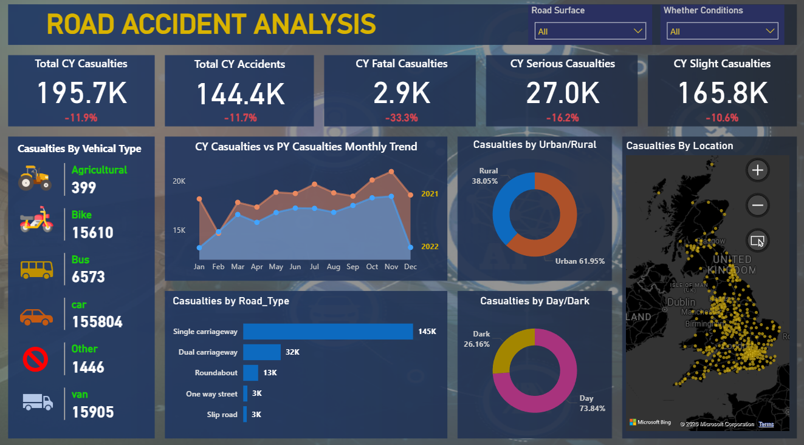

# Road_Accident_Analysis_PowerBI

## Project Overview
This project focuses on analyzing road accident data using Power BI to identify patterns, trends, and key factors contributing to accidents. The dashboard provides insights that can help improve road safety and decision-making.

---

## Objectives
- Analyze total accidents and casualties
- Identify high-risk locations and time periods
- Understand accident causes and severity
- Visualize trends for better decision-making

---

## Dataset
The dataset used in this project is large (~60MB), so it is not uploaded directly to GitHub.

**Download Dataset Here:** https://1drv.ms/x/c/8f3622ed1295642f/IQCiJxy--YmRQbyE9nCCeyv3Abm0fYSOFNTTSu5FQxK_eF0?e=4FJexG

---

## Tools & Technologies Used
- Power BI
- Data Cleaning
- Data Visualization
- DAX (Data Analysis Expressions)

---

## Key Insights
- Peak accident times identified
- Most affected regions highlighted
- Major causes of accidents analyzed
- Year-wise and month-wise trends visualized

---

## Dashboard Features
- Interactive filters (Region, Date, Severity)
- KPI cards for quick insights
- Graphs and charts for trends
- User-friendly design

---

## Dashboard Preview

---

## How to Use
1. Download the dataset from the link above
2. Open the `.pbix` file in Power BI
3. Explore the dashboard using filters

---

## Future Improvements
- Add real-time data integration
- Improve predictive analysis
- Include more datasets for deeper insights

---

## Author
**Diksha Zope**

---

⭐ If you like this project, don’t forget to star the repository!
